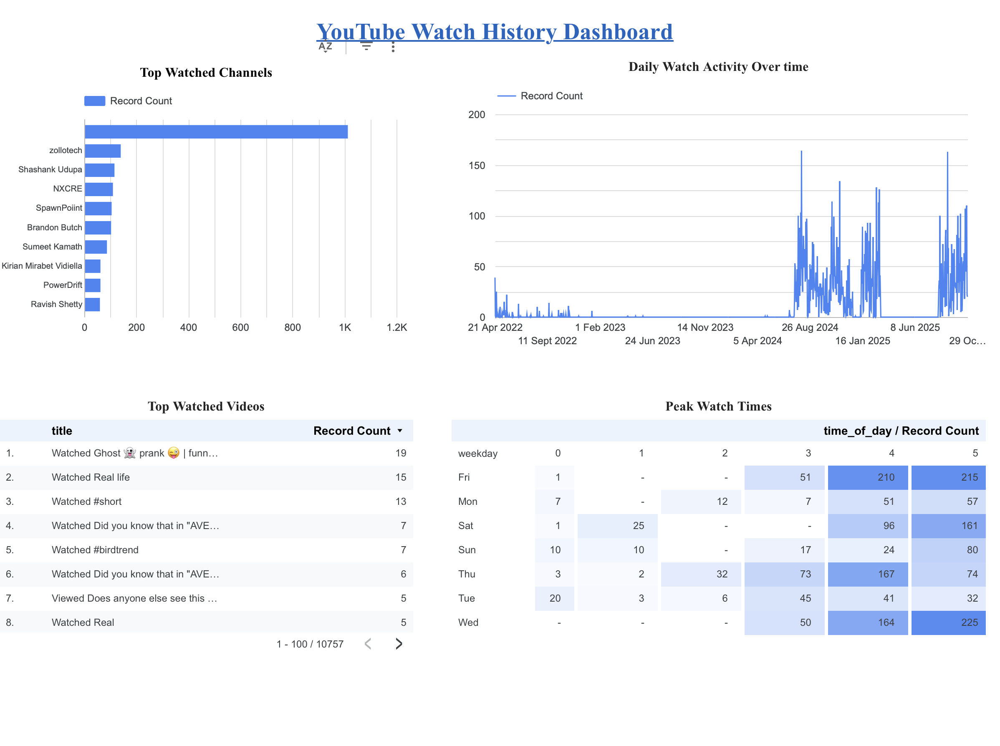
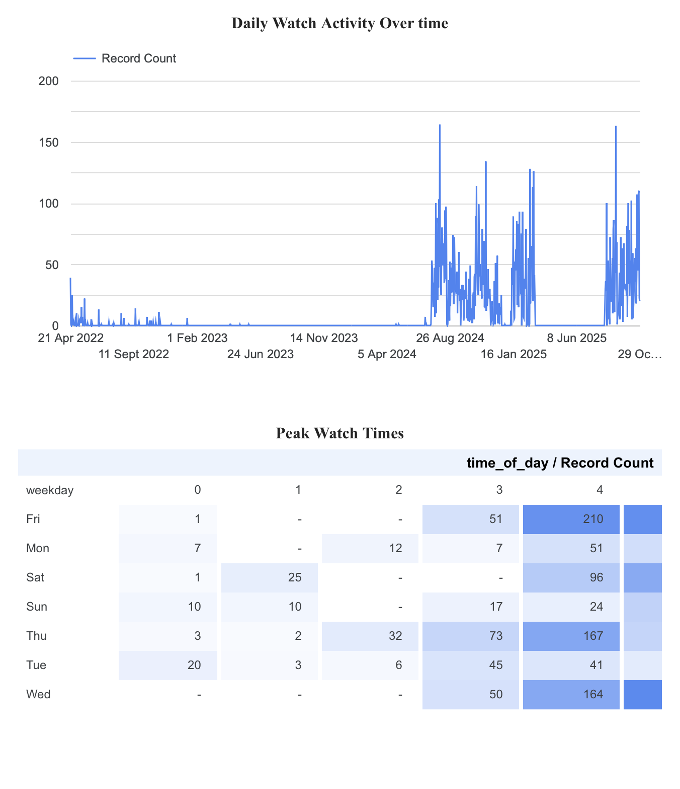
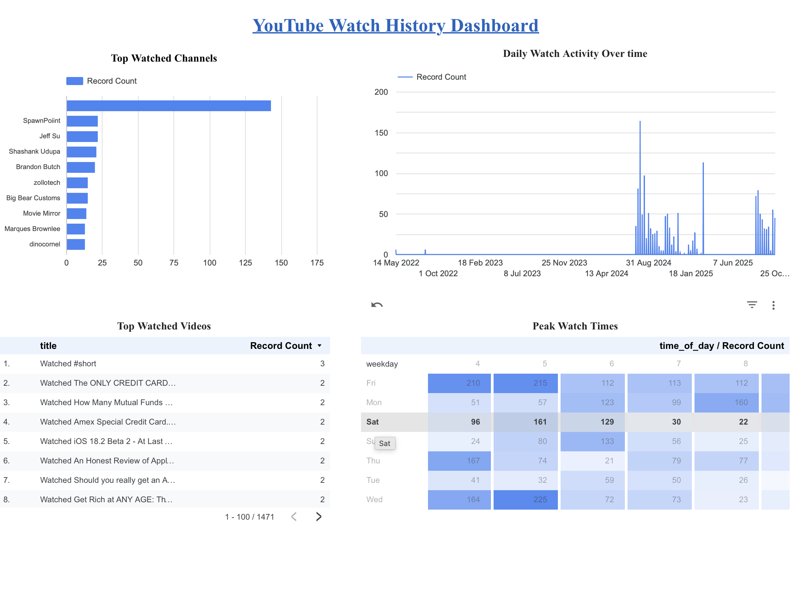

# YouTube Watch History: Data Pipeline & BI Dashboard 📺

## 🚀 Project Overview

This project is an end-to-end **Analytics Engineering** demonstration. I built a data pipeline to extract my personal YouTube viewing history (JSON), transform it into a structured schema, and visualize behavioral trends in an interactive **Looker Studio Dashboard**.

The goal was to move beyond the standard "YouTube Recap" and engineer a custom solution to answer specific questions about content consumption habits and peak viewing times.

## ⚙️ Technical Architecture (ETL Pipeline)

### 1. Extract (Data Ingestion)

* **Source:** Google Takeout API.
* **Format:** Raw `watch-history.json` (Semi-structured data).
* **Challenge:** The raw data was nested JSON, making it incompatible with standard BI tools immediately.

### 2. Transform (Data Cleaning & Modeling)

* **Normalization:** Converted JSON to flat CSV format using `konklone.io` JSON-to-CSV converter.
* **Feature Engineering (Google Sheets):**
  * **Timestamp Parsing:** Used `DATEVALUE` and `HOUR` formulas to break down ISO timestamps into `Date`, `Time_of_Day`, and `Weekday` for temporal analysis.
  * **Regex Extraction:** Applied `REGEXEXTRACT` to isolate Channel Names from the raw title strings.
  * **Schema Logic:** Implemented `ARRAYFORMULA` to ensure data transformations applied dynamically to new rows.

* **Data Governance:** Created a sanitized view (`final_data.csv`) by removing PII (Personal Identifiable Information) such as specific `watch_urls` to ensure privacy before public display.

### 3. Load & Visualize

* **Destination:** Google Looker Studio.
* **Data Model:** Connected the sanitized `data/final_data.csv` as the primary data source.

## 📊 Key Insights & Dashboard Features

### 1. Temporal Heatmaps

* **Metric:** Viewing frequency by *Hour of Day* vs. *Day of Week*.
* **Insight:** Identified a clear behavior pattern: Peak viewing occurs on **Sundays** and **late evenings (9 PM - 12 AM)**, suggesting a specific post-work/weekend relaxation habit.

### 2. Channel & Content Analysis

* **Drill-Down:** Analysis of "Top 10 Channels" by frequency.
* **Category Tagging:** Automated tagging of video titles into categories (e.g., "Tech," "Entertainment") using string matching.

## 🖼️ Dashboard Preview

### Full Dashboard View

### Time Analysis (Heatmap)

### Filtered View (Detailed)

## 🔗 Live Demo

[View Interactive Dashboard on Looker Studio](https://lookerstudio.google.com/reporting/0b8971f1-b4ff-4892-b548-a61d96eea6b4)

---
*Tools Used: Google Takeout (JSON), Google Sheets (Advanced Formulas, Regex), Looker Studio, JSON Parsing.*
